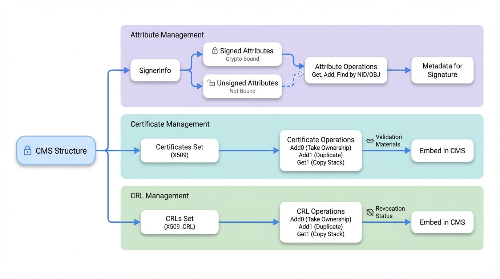

# Attribute & Cert API

This section provides a detailed reference for functions that manage attributes, certificates, and Certificate Revocation Lists (CRLs) within a Cryptographic Message Syntax (CMS) structure. These components are critical for building a verifiable trust chain, as they carry the metadata necessary for signature validation, including signer certificates and revocation status. Proper management of these elements is essential for creating compliant and secure messages.

The following diagram illustrates the relationship between the API functions and the CMS structure they manage:

<!-- DIAGRAM_IMAGE_START:architecture:16:9 -->

<!-- DIAGRAM_IMAGE_END -->

## Attribute Management

Attributes provide additional information about a signer or a signature. They are categorized as signed or unsigned. Signed attributes are part of the data that gets digitally signed, protecting them from modification, while unsigned attributes are not.

### Signed Attribute Functions

Signed attributes are stored within the `SignerInfo` structure and are cryptographically bound to the signature. Common signed attributes include content type, signing time, and message digest.

<x-field-group>
  <x-field data-name="CMS_signed_get_attr_count()" data-type="int">
    <x-field-desc markdown>Retrieves the total number of signed attributes in a `CMS_SignerInfo` structure.</x-field-desc>
    <x-field data-name="parameters" data-type="object">
      <x-field data-name="si" data-type="const CMS_SignerInfo *" data-required="true" data-desc="A pointer to the SignerInfo structure."></x-field>
    </x-field>
    <x-field data-name="returnValue" data-type="int" data-desc="The attribute count, or -1 on error."></x-field>
  </x-field>
  <x-field data-name="CMS_signed_get_attr_by_NID()" data-type="int">
    <x-field-desc markdown>Finds the location of a signed attribute by its NID (e.g., `NID_pkcs9_signingTime`).</x-field-desc>
    <x-field data-name="parameters" data-type="object">
      <x-field data-name="si" data-type="const CMS_SignerInfo *" data-required="true" data-desc="A pointer to the SignerInfo structure."></x-field>
      <x-field data-name="nid" data-type="int" data-required="true" data-desc="The NID of the attribute to find."></x-field>
      <x-field data-name="lastpos" data-type="int" data-required="true" data-desc="The starting search position. Use -1 for the first call."></x-field>
    </x-field>
    <x-field data-name="returnValue" data-type="int" data-desc="The attribute location index, or -1 if not found."></x-field>
  </x-field>
  <x-field data-name="CMS_signed_get_attr_by_OBJ()" data-type="int">
    <x-field-desc markdown>Finds the location of a signed attribute by its ASN.1 OBJECT identifier.</x-field-desc>
    <x-field data-name="parameters" data-type="object">
      <x-field data-name="si" data-type="const CMS_SignerInfo *" data-required="true" data-desc="A pointer to the SignerInfo structure."></x-field>
      <x-field data-name="obj" data-type="const ASN1_OBJECT *" data-required="true" data-desc="The ASN.1 OBJECT of the attribute."></x-field>
      <x-field data-name="lastpos" data-type="int" data-required="true" data-desc="The starting search position. Use -1 for the first call."></x-field>
    </x-field>
    <x-field data-name="returnValue" data-type="int" data-desc="The attribute location index, or -1 if not found."></x-field>
  </x-field>
  <x-field data-name="CMS_signed_get_attr()" data-type="X509_ATTRIBUTE *">
    <x-field-desc markdown>Retrieves a signed attribute at a specific location index.</x-field-desc>
    <x-field data-name="parameters" data-type="object">
      <x-field data-name="si" data-type="const CMS_SignerInfo *" data-required="true" data-desc="A pointer to the SignerInfo structure."></x-field>
      <x-field data-name="loc" data-type="int" data-required="true" data-desc="The location index of the attribute."></x-field>
    </x-field>
    <x-field data-name="returnValue" data-type="X509_ATTRIBUTE *" data-desc="A pointer to the attribute, or NULL on error."></x-field>
  </x-field>
  <x-field data-name="CMS_signed_add1_attr()" data-type="int">
    <x-field-desc markdown>Adds a pre-existing `X509_ATTRIBUTE` structure as a signed attribute.</x-field-desc>
    <x-field data-name="parameters" data-type="object">
      <x-field data-name="si" data-type="CMS_SignerInfo *" data-required="true" data-desc="A pointer to the SignerInfo structure."></x-field>
      <x-field data-name="attr" data-type="X509_ATTRIBUTE *" data-required="true" data-desc="The attribute to add."></x-field>
    </x-field>
    <x-field data-name="returnValue" data-type="int" data-desc="Returns 1 for success or 0 for failure."></x-field>
  </x-field>
  <x-field data-name="CMS_signed_add1_attr_by_txt()" data-type="int">
    <x-field-desc markdown>Creates and adds a signed attribute using its string representation (e.g., "signingTime").</x-field-desc>
    <x-field data-name="parameters" data-type="object">
      <x-field data-name="si" data-type="CMS_SignerInfo *" data-required="true" data-desc="A pointer to the SignerInfo structure."></x-field>
      <x-field data-name="attrname" data-type="const char *" data-required="true" data-desc="The object name."></x-field>
      <x-field data-name="type" data-type="int" data-required="true" data-desc="The ASN.1 type of the data (e.g., `V_ASN1_UTCTIME`)."></x-field>
      <x-field data-name="bytes" data-type="const void *" data-required="true" data-desc="A pointer to the attribute data."></x-field>
      <x-field data-name="len" data-type="int" data-required="true" data-desc="The length of the attribute data."></x-field>
    </x-field>
    <x-field data-name="returnValue" data-type="int" data-desc="Returns 1 for success or 0 for failure."></x-field>
  </x-field>
</x-field-group>

### Unsigned Attribute Functions

Unsigned attributes are associated with a `SignerInfo` structure but are not part of the signature calculation. They can be added or removed without invalidating the signature. A common example is a countersignature.

<x-field-group>
  <x-field data-name="CMS_unsigned_get_attr_count()" data-type="int">
    <x-field-desc markdown>Retrieves the total number of unsigned attributes in a `CMS_SignerInfo` structure.</x-field-desc>
    <x-field data-name="parameters" data-type="object">
      <x-field data-name="si" data-type="const CMS_SignerInfo *" data-required="true" data-desc="A pointer to the SignerInfo structure."></x-field>
    </x-field>
    <x-field data-name="returnValue" data-type="int" data-desc="The attribute count, or -1 on error."></x-field>
  </x-field>
  <x-field data-name="CMS_unsigned_get_attr_by_NID()" data-type="int">
    <x-field-desc markdown>Finds the location of an unsigned attribute by its NID.</x-field-desc>
    <x-field data-name="parameters" data-type="object">
      <x-field data-name="si" data-type="const CMS_SignerInfo *" data-required="true" data-desc="A pointer to the SignerInfo structure."></x-field>
      <x-field data-name="nid" data-type="int" data-required="true" data-desc="The NID of the attribute to find."></x-field>
      <x-field data-name="lastpos" data-type="int" data-required="true" data-desc="The starting search position. Use -1 for the first call."></x-field>
    </x-field>
    <x-field data-name="returnValue" data-type="int" data-desc="The attribute location index, or -1 if not found."></x-field>
  </x-field>
  <x-field data-name="CMS_unsigned_get_attr_by_OBJ()" data-type="int">
    <x-field-desc markdown>Finds the location of an unsigned attribute by its ASN.1 OBJECT identifier.</x-field-desc>
    <x-field data-name="parameters" data-type="object">
      <x-field data-name="si" data-type="const CMS_SignerInfo *" data-required="true" data-desc="The SignerInfo structure."></x-field>
      <x-field data-name="obj" data-type="const ASN1_OBJECT *" data-required="true" data-desc="The ASN.1 OBJECT of the attribute."></x-field>
      <x-field data-name="lastpos" data-type="int" data-required="true" data-desc="The starting search position. Use -1 for the first call."></x-field>
    </x-field>
    <x-field data-name="returnValue" data-type="int" data-desc="The attribute location index, or -1 if not found."></x-field>
  </x-field>
  <x-field data-name="CMS_unsigned_get_attr()" data-type="X509_ATTRIBUTE *">
    <x-field-desc markdown>Retrieves an unsigned attribute at a specific location index.</x-field-desc>
    <x-field data-name="parameters" data-type="object">
      <x-field data-name="si" data-type="const CMS_SignerInfo *" data-required="true" data-desc="A pointer to the SignerInfo structure."></x-field>
      <x-field data-name="loc" data-type="int" data-required="true" data-desc="The location index of the attribute."></x-field>
    </x-field>
    <x-field data-name="returnValue" data-type="X509_ATTRIBUTE *" data-desc="A pointer to the attribute, or NULL on error."></x-field>
  </x-field>
  <x-field data-name="CMS_unsigned_add1_attr()" data-type="int">
    <x-field-desc markdown>Adds a pre-existing `X509_ATTRIBUTE` structure as an unsigned attribute.</x-field-desc>
    <x-field data-name="parameters" data-type="object">
      <x-field data-name="si" data-type="CMS_SignerInfo *" data-required="true" data-desc="A pointer to the SignerInfo structure."></x-field>
      <x-field data-name="attr" data-type="X509_ATTRIBUTE *" data-required="true" data-desc="The attribute to add."></x-field>
    </x-field>
    <x-field data-name="returnValue" data-type="int" data-desc="Returns 1 for success or 0 for failure."></x-field>
  </x-field>
  <x-field data-name="CMS_unsigned_add1_attr_by_txt()" data-type="int">
    <x-field-desc markdown>Creates and adds an unsigned attribute using its string representation.</x-field-desc>
    <x-field data-name="parameters" data-type="object">
      <x-field data-name="si" data-type="CMS_SignerInfo *" data-required="true" data-desc="A pointer to the SignerInfo structure."></x-field>
      <x-field data-name="attrname" data-type="const char *" data-required="true" data-desc="The object name."></x-field>
      <x-field data-name="type" data-type="int" data-required="true" data-desc="The ASN.1 type of the data."></x-field>
      <x-field data-name="bytes" data-type="const void *" data-required="true" data-desc="A pointer to the attribute data."></x-field>
      <x-field data-name="len" data-type="int" data-required="true" data-desc="The length of the attribute data."></x-field>
    </x-field>
    <x-field data-name="returnValue" data-type="int" data-desc="Returns 1 for success or 0 for failure."></x-field>
  </x-field>
</x-field-group>

## Certificate Management

CMS messages can embed the certificates needed to verify their signatures. These functions allow you to add certificates to the `certificates` set in a `SignedData` or `EnvelopedData` structure.

<x-field-group>
  <x-field data-name="CMS_add0_cert()" data-type="int">
    <x-field-desc markdown>Adds a certificate to the CMS structure. The CMS structure takes ownership of the certificate pointer, so it should not be freed separately.</x-field-desc>
    <x-field data-name="parameters" data-type="object">
      <x-field data-name="cms" data-type="CMS_ContentInfo *" data-required="true" data-desc="A pointer to the CMS_ContentInfo structure."></x-field>
      <x-field data-name="cert" data-type="X509 *" data-required="true" data-desc="The certificate to add."></x-field>
    </x-field>
    <x-field data-name="returnValue" data-type="int" data-desc="Returns 1 for success or 0 for failure."></x-field>
  </x-field>
  <x-field data-name="CMS_add1_cert()" data-type="int">
    <x-field-desc markdown>Adds a certificate to the CMS structure by duplicating it. The caller retains ownership of the original certificate pointer.</x-field-desc>
    <x-field data-name="parameters" data-type="object">
      <x-field data-name="cms" data-type="CMS_ContentInfo *" data-required="true" data-desc="A pointer to the CMS_ContentInfo structure."></x-field>
      <x-field data-name="cert" data-type="X509 *" data-required="true" data-desc="The certificate to add."></x-field>
    </x-field>
    <x-field data-name="returnValue" data-type="int" data-desc="Returns 1 for success or 0 for failure."></x-field>
  </x-field>
  <x-field data-name="CMS_get1_certs()" data-type="STACK_OF(X509) *">
    <x-field-desc markdown>Retrieves a copy of all certificates from the CMS structure. The returned stack and its contents must be freed by the caller.</x-field-desc>
    <x-field data-name="parameters" data-type="object">
      <x-field data-name="cms" data-type="CMS_ContentInfo *" data-required="true" data-desc="A pointer to the CMS_ContentInfo structure."></x-field>
    </x-field>
    <x-field data-name="returnValue" data-type="STACK_OF(X509) *" data-desc="A stack of certificates, or NULL on error."></x-field>
  </x-field>
</x-field-group>

## Certificate Revocation List (CRL) Management

To ensure a certificate has not been revoked, a CRL can be included in the CMS message. These functions manage the `crls` set within a `SignedData` structure.

<x-field-group>
  <x-field data-name="CMS_add0_crl()" data-type="int">
    <x-field-desc markdown>Adds a CRL to the CMS structure. The CMS structure takes ownership of the CRL pointer, so it should not be freed separately.</x-field-desc>
    <x-field data-name="parameters" data-type="object">
      <x-field data-name="cms" data-type="CMS_ContentInfo *" data-required="true" data-desc="A pointer to the CMS_ContentInfo structure."></x-field>
      <x-field data-name="crl" data-type="X509_CRL *" data-required="true" data-desc="The CRL to add."></x-field>
    </x-field>
    <x-field data-name="returnValue" data-type="int" data-desc="Returns 1 for success or 0 for failure."></x-field>
  </x-field>
  <x-field data-name="CMS_add1_crl()" data-type="int">
    <x-field-desc markdown>Adds a CRL to the CMS structure by duplicating it. The caller retains ownership of the original CRL pointer.</x-field-desc>
    <x-field data-name="parameters" data-type="object">
      <x-field data-name="cms" data-type="CMS_ContentInfo *" data-required="true" data-desc="A pointer to the CMS_ContentInfo structure."></x-field>
      <x-field data-name="crl" data-type="X509_CRL *" data-required="true" data-desc="The CRL to add."></x-field>
    </x-field>
    <x-field data-name="returnValue" data-type="int" data-desc="Returns 1 for success or 0 for failure."></x-field>
  </x-field>
  <x-field data-name="CMS_get1_crls()" data-type="STACK_OF(X509_CRL) *">
    <x-field-desc markdown>Retrieves a copy of all CRLs from the CMS structure. The returned stack and its contents must be freed by the caller.</x-field-desc>
    <x-field data-name="parameters" data-type="object">
      <x-field data-name="cms" data-type="CMS_ContentInfo *" data-required="true" data-desc="A pointer to the CMS_ContentInfo structure."></x-field>
    </x-field>
    <x-field data-name="returnValue" data-type="STACK_OF(X509_CRL) *" data-desc="A stack of CRLs, or NULL on error."></x-field>
  </x-field>
</x-field-group>

## Summary

The functions detailed in this section provide a complete toolkit for managing the auxiliary information that accompanies a CMS message. Use the attribute functions to add signed or unsigned metadata to a signature, and employ the certificate and CRL functions to embed the necessary validation materials directly within the CMS structure.

For related information on managing signers and signatures, refer to the [SignerInfo Functions](./api-signerinfo.md) documentation. For higher-level operations, see the [Main Functions](./api-main.md) guide.
