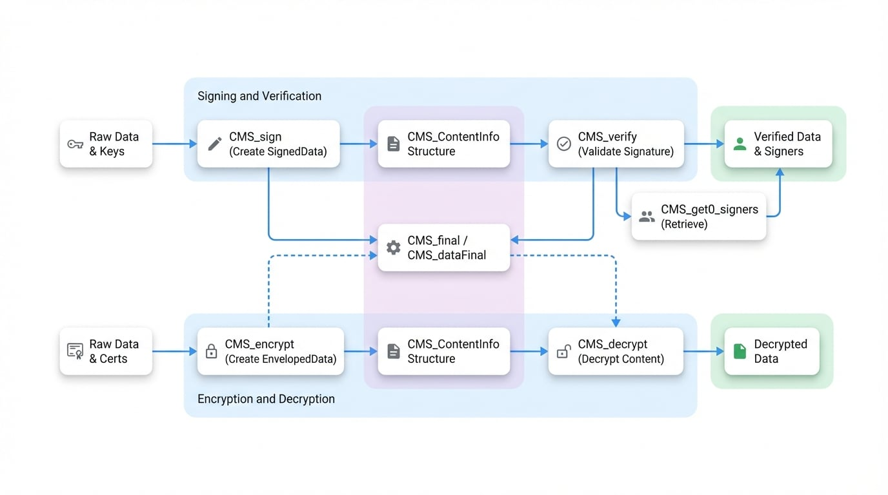

# 主要関数

このセクションでは、主要な Cryptographic Message Syntax (CMS) 構造を作成、解析、ファイナライズ、および管理するために使用される高レベル関数の詳細なリファレンスを提供します。これらの関数は、データの署名、検証、暗号化、復号などの一般的な操作の主要なエントリーポイントとして機能します。

以下の図は、データの署名/検証および暗号化/復号フローにおける主要な CMS 関数間の関係を示しています。

<!-- DIAGRAM_IMAGE_START:flowchart:16:9 -->

<!-- DIAGRAM_IMAGE_END -->

## 署名と検証

これらの関数は、データの完全性と信頼性を保証するために不可欠な CMS `SignedData` 構造の作成と検証を処理します。

### CMS_sign

`CMS_sign()` および `CMS_sign_ex()` 関数は、`SignedData` 型の `CMS_ContentInfo` 構造を作成します。この操作には、秘密鍵でデータに署名し、対応する証明書と追加の証明書を含めて、完全で検証可能なメッセージを形成することが含まれます。

#### 概要

```c
#include <openssl/cms.h>

CMS_ContentInfo *CMS_sign(X59 *signcert, EVP_PKEY *pkey, STACK_OF(X509) *certs,
                          BIO *data, unsigned int flags);

CMS_ContentInfo *CMS_sign_ex(X509 *signcert, EVP_PKEY *pkey,
                             STACK_OF(X509) *certs, BIO *data,
                             unsigned int flags, OSSL_LIB_CTX *libctx,
                             const char *propq);
```

#### パラメータ

<x-field-group>
  <x-field data-name="signcert" data-type="X509*" data-required="false" data-desc="署名者の証明書。証明書のみの構造の場合は NULL にできます。"></x-field>
  <x-field data-name="pkey" data-type="EVP_PKEY*" data-required="false" data-desc="signcert に対応する秘密鍵。証明書のみの構造の場合は NULL にできます。"></x-field>
  <x-field data-name="certs" data-type="STACK_OF(X509)*" data-required="false" data-desc="構造に含める追加証明書のオプションのスタック。中間 CA など。"></x-field>
  <x-field data-name="data" data-type="BIO*" data-required="true" data-desc="署名されるデータを含む BIO。"></x-field>
  <x-field data-name="flags" data-type="unsigned int" data-required="true" data-desc="署名操作を制御するためのフラグのビットマスク。"></x-field>
  <x-field data-name="libctx" data-type="OSSL_LIB_CTX*" data-required="false" data-desc="OpenSSL ライブラリコンテキスト (CMS_sign_ex 用)。NULL の場合、デフォルトコンテキストが使用されます。"></x-field>
  <x-field data-name="propq" data-type="const char*" data-required="false" data-desc="アルゴリズム取得のためのプロパティクエリ文字列 (CMS_sign_ex 用)。"></x-field>
</x-field-group>

#### フラグ

`flags` パラメータは署名操作の動作を変更します。複数のフラグはビット単位の OR を使用して組み合わせることができます。

| フラグ | 説明 |
| --- | --- |
| `CMS_TEXT` | コンテンツの前に標準の `text/plain` MIME ヘッダーを追加します。 |
| `CMS_NOCERTS` | `SignedData` 構造から署名者の証明書を除外します。署名のためには `signcert` パラメータに証明書が依然として必要です。 |
| `CMS_DETACHED` | 分離署名を作成します。コンテンツは最終的な `CMS_ContentInfo` 構造に含まれません。 |
| `CMS_BINARY` | コンテンツの MIME 正準化を防ぎます。これはバイナリデータが破損するのを防ぐために不可欠です。 |
| `CMS_NOATTR` | 署名時刻や SMIMECapabilities を含むすべての署名付き属性を除外します。 |
| `CMS_NOSMIMECAP` | `SMIMECapabilities` 署名付き属性を省略します。 |
| `CMS_NO_SIGNING_TIME` | 署名時刻属性を省略します。 |
| `CMS_USE_KEYID` | デフォルトの発行者とシリアル番号の代わりに、サブジェクトキー識別子によって署名者の証明書を識別します。 |
| `CMS_STREAM` | ストリーミング用に `CMS_ContentInfo` 構造を初期化しますが、実際の署名は延期します。データはファイナライズ中に読み取られ、処理されます。 |
| `CMS_PARTIAL` | 部分的な `CMS_ContentInfo` 構造を作成し、`CMS_final()` を呼び出す前により多くの署名者や属性を追加できるようにします。 |

#### 戻り値

成功した場合は有効な `CMS_ContentInfo` 構造を返し、失敗した場合は `NULL` を返します。エラーは OpenSSL のエラーキューから取得できます。

### CMS_verify

`CMS_verify()` 関数は、CMS `SignedData` 構造を検証します。署名されたコンテンツの完全性をチェックし、署名者の署名を検証し、オプションで署名者の証明書チェーンを信頼されたストアに対して検証します。

#### 概要

```c
#include <openssl/cms.h>

int CMS_verify(CMS_ContentInfo *cms, STACK_OF(X509) *certs, X509_STORE *store,
               BIO *detached_data, BIO *out, unsigned int flags);
```

#### パラメータ

<x-field-group>
  <x-field data-name="cms" data-type="CMS_ContentInfo*" data-required="true" data-desc="検証する CMS_ContentInfo 構造。"></x-field>
  <x-field data-name="certs" data-type="STACK_OF(X509)*" data-required="false" data-desc="署名者の証明書を検索し、チェーン構築を補助するために使用される、信頼されていない証明書のオプションのスタック。"></x-field>
  <x-field data-name="store" data-type="X509_STORE*" data-required="false" data-desc="パス検証のための信頼された証明書ストア。"></x-field>
  <x-field data-name="detached_data" data-type="BIO*" data-required="false" data-desc="署名が分離されている場合にコンテンツを含む BIO。包含署名の場合は NULL であるべきです。"></x-field>
  <x-field data-name="out" data-type="BIO*" data-required="false" data-desc="検証済みのコンテンツを書き込むための BIO。NULL の場合、コンテンツは読み取られ検証されますが、書き込まれません。"></x-field>
  <x-field data-name="flags" data-type="unsigned int" data-required="true" data-desc="検証操作を制御するためのフラグのビットマスク。"></x-field>
</x-field-group>

#### フラグ

| フラグ | 説明 |
| --- | --- |
| `CMS_NOINTERN` | CMS 構造自体から署名者の証明書を検索するのを防ぎます。証明書は `certs` パラメータで提供されなければなりません。 |
| `CMS_TEXT` | コンテンツから `text/plain` MIME ヘッダーを削除します。コンテンツタイプが `text/plain` でない場合、エラーが発生します。 |
| `CMS_NO_SIGNER_CERT_VERIFY` | 署名者の証明書の証明書チェーン検証をスキップします。 |
| `CMS_NO_ATTR_VERIFY` | 署名付き属性の署名の検証をスキップします。 |
| `CMS_NO_CONTENT_VERIFY` | コンテンツダイジェストの検証をスキップします。これは、署名はチェックされますが、コンテンツ自体はそれに対して検証されないことを意味します。 |
| `CMS_NOCRL` | 証明書検証中に CMS 構造に存在する CRL を無視します。 |
| `CMS_CADES` | CAdES 固有のチェックを有効にします。例えば、`signingCertificate` または `signingCertificateV2` 属性の検証などです。 |

#### 戻り値

検証に成功した場合は `1` を、失敗した場合は `0` を返します。詳細なエラー情報は OpenSSL のエラーキューから取得できます。

### CMS_get0_signers

このユーティリティ関数は、`CMS_ContentInfo` 構造からすべての署名者の証明書を取得します。検証プロセスが各 `SignerInfo` に証明書を見つけて関連付ける役割を担うため、検証が成功した後にのみ呼び出すべきです。

#### 概要

```c
#include <openssl/cms.h>

STACK_OF(X509) *CMS_get0_signers(CMS_ContentInfo *cms);
```

#### パラメータ

<x-field-group>
  <x-field data-name="cms" data-type="CMS_ContentInfo*" data-required="true" data-desc="正常に検証された CMS 構造。"></x-field>
</x-field-group>

#### 戻り値

署名者の証明書を含む内部 `STACK_OF(X509)` へのポインタを返します。このポインタはアプリケーションによって解放されるべきではありません。エラーが発生した場合や署名者が見つからない場合は `NULL` を返します。

## 暗号化と復号

これらの関数は、1 人以上の受信者のためにデータを暗号化および復号するための `EnvelopedData` 構造を作成および解析するために使用されます。

### CMS_encrypt

`CMS_encrypt()` および `CMS_encrypt_ex()` 関数は、`EnvelopedData` または `AuthEnvelopedData` 型の `CMS_ContentInfo` 構造を作成します。コンテンツはランダムに生成された対称鍵で暗号化され、その鍵は各受信者の公開鍵で暗号化されることで、各受信者に安全に配布されます。

#### 概要

```c
#include <openssl/cms.h>

CMS_ContentInfo *CMS_encrypt(STACK_OF(X509) *certs, BIO *in,
                             const EVP_CIPHER *cipher, unsigned int flags);

CMS_ContentInfo *CMS_encrypt_ex(STACK_OF(X509) *certs, BIO *in,
                                const EVP_CIPHER *cipher, unsigned int flags,
                                OSSL_LIB_CTX *libctx, const char *propq);
```

#### パラメータ

<x-field-group>
  <x-field data-name="certs" data-type="STACK_OF(X509)*" data-required="true" data-desc="受信者の証明書のスタック。"></x-field>
  <x-field data-name="in" data-type="BIO*" data-required="true" data-desc="暗号化されるデータを含む BIO。"></x-field>
  <x-field data-name="cipher" data-type="const EVP_CIPHER*" data-required="true" data-desc="コンテンツ暗号化に使用する対称暗号 (例: EVP_aes_256_cbc())。"></x-field>
  <x-field data-name="flags" data-type="unsigned int" data-required="true" data-desc="暗号化操作を制御するためのフラグのビットマスク。"></x-field>
  <x-field data-name="libctx" data-type="OSSL_LIB_CTX*" data-required="false" data-desc="OpenSSL ライブラリコンテキスト (CMS_encrypt_ex 用)。NULL の場合、デフォルトコンテキストが使用されます。"></x-field>
  <x-field data-name="propq" data-type="const char*" data-required="false" data-desc="アルゴリズム取得のためのプロパティクエリ文字列 (CMS_encrypt_ex 用)。"></x-field>
</x-field-group>

#### フラグ

| フラグ | 説明 |
| --- | --- |
| `CMS_TEXT` | 暗号化の前に、コンテンツの前に標準の `text/plain` MIME ヘッダーを追加します。 |
| `CMS_BINARY` | コンテンツの MIME 正準化を防ぎます。これはバイナリデータに必要です。 |
| `CMS_USE_KEYID` | 受信者をサブジェクトキー識別子で識別します。受信者の証明書にこの拡張機能がない場合、エラーが発生します。 |
| `CMS_STREAM` | ストリーミング I/O 用に `CMS_ContentInfo` 構造を初期化しますが、入力 BIO からのデータ読み取りは延期します。 |
| `CMS_PARTIAL` | 部分的な `CMS_ContentInfo` 構造を作成し、ファイナライズ前により多くの受信者を追加できるようにします。 |
| `CMS_DETACHED` | 最終的な構造から暗号化されたコンテンツを省略します。これはめったに使用されません。 |

#### 戻り値

成功した場合は有効な `CMS_ContentInfo` 構造を返し、失敗した場合は `NULL` を返します。

### CMS_decrypt

`CMS_decrypt()` 関数は、`EnvelopedData` または `AuthEnvelopedData` 型の `CMS_ContentInfo` 構造を復号します。受信者の秘密鍵を使用してコンテンツ暗号化鍵を復号し、その鍵を使用して実際のコンテンツを復号します。

#### 概要

```c
#include <openssl/cms.h>

int CMS_decrypt(CMS_ContentInfo *cms, EVP_PKEY *pkey, X509 *cert,
                BIO *dcont, BIO *out, unsigned int flags);
```

#### パラメータ

<x-field-group>
  <x-field data-name="cms" data-type="CMS_ContentInfo*" data-required="true" data-desc="復号する CMS 構造。"></x-field>
  <x-field data-name="pkey" data-type="EVP_PKEY*" data-required="true" data-desc="受信者の秘密鍵。"></x-field>
  <x-field data-name="cert" data-type="X509*" data-required="false" data-desc="受信者の証明書。復号に厳密には必要ありませんが、正しい RecipientInfo を特定し、潜在的な攻撃を防ぐために強く推奨されます。"></x-field>
  <x-field data-name="dcont" data-type="BIO*" data-required="false" data-desc="暗号化されたコンテンツが分離されている場合にそれを含む BIO。通常は NULL。"></x-field>
  <x-field data-name="out" data-type="BIO*" data-required="true" data-desc="復号されたコンテンツを書き込むための BIO。"></x-field>
  <x-field data-name="flags" data-type="unsigned int" data-required="true" data-desc="復号を制御するためのフラグのビットマスク。"></x-field>
</x-field-group>

#### フラグ

| フラグ | 説明 |
| --- | --- |
| `CMS_TEXT` | 復号されたコンテンツから `text/plain` MIME ヘッダーを削除します。コンテンツタイプが `text/plain` でない場合、エラーが発生します。 |
| `CMS_DEBUG_DECRYPT` | MMA (Bleichenbacher の攻撃) 対策を無効にします。どの受信者の鍵も正常に復号できない場合、ランダムな鍵で復号する代わりに、すぐにエラーが返されます。細心の注意を払って使用してください。 |

#### 戻り値

成功した場合は `1` を、失敗した場合は `0` を返します。

### ヘルパー復号関数

より詳細な制御を行うために、以下の関数を使用して事前に復号鍵を設定し、その後 `pkey` と `cert` を `NULL` に設定して `CMS_decrypt()` を呼び出すことができます。

#### 概要

```c
#include <openssl/cms.h>

int CMS_decrypt_set1_pkey(CMS_ContentInfo *cms, EVP_PKEY *pk, X509 *cert);

int CMS_decrypt_set1_pkey_and_peer(CMS_ContentInfo *cms, EVP_PKEY *pk,
                                   X509 *cert, X509 *peer);

int CMS_decrypt_set1_password(CMS_ContentInfo *cms,
                              unsigned char *pass, ossl_ssize_t passlen);
```

#### 説明

- `CMS_decrypt_set1_pkey()` と `CMS_decrypt_set1_pkey_and_peer()` は、秘密鍵 `pk` を使用してコンテンツ暗号化鍵を復号します。証明書 `cert` は正しい `RecipientInfo` を特定するのに役立ちます。`peer` 証明書は鍵合意スキーム用です。
- `CMS_decrypt_set1_password()` は、`PWRI` (Password Recipient Info) 型のためにパスワードを使用して復号します。

これらの関数は成功時に `1` を、失敗時に `0` を返します。

## ファイナライズ関数

`CMS_STREAM` または `CMS_PARTIAL` フラグを使用して CMS 構造を作成する場合、すべてのデータが処理された後に構造を完了させるためのファイナライズステップが必要です。

### CMS_final

`CMS_final()` 関数は `CMS_ContentInfo` 構造をファイナライズします。これは通常、ストリーミング BIO を通してすべてのコンテンツが書き込まれた後に、ダイジェストと署名を計算してエンコードすることを含みます。この関数は、ストリーミング I/O を使用せずに `CMS_PARTIAL` フラグを使用する場合に不可欠です。

#### 概要

```c
#include <openssl/cms.h>

int CMS_final(CMS_ContentInfo *cms, BIO *data, BIO *dcont, unsigned int flags);
```

#### パラメータ

<x-field-group>
  <x-field data-name="cms" data-type="CMS_ContentInfo*" data-required="true" data-desc="ファイナライズする部分的な CMS 構造。"></x-field>
  <x-field data-name="data" data-type="BIO*" data-required="true" data-desc="処理されるコンテンツを含む BIO。"></x-field>
  <x-field data-name="dcont" data-type="BIO*" data-required="false" data-desc="処理後にコンテンツを書き込むための BIO (分離署名用)。通常は NULL。"></x-field>
  <x-field data-name="flags" data-type="unsigned int" data-required="true" data-desc="MIME 正準化など、処理を制御するためのフラグ。"></x-field>
</x-field-group>

#### 戻り値

成功した場合は `1` を、失敗した場合は `0` を返します。

### CMS_dataFinal

`CMS_dataFinal()` および `CMS_dataFinal_ex()` 関数は、ストリーミングが有効な場合に CMS 構造をファイナライズするために使用されます。これらは `i2d_CMS_bio_stream()` のような関数によって内部的に呼び出されますが、より細かい制御のために直接使用することもできます。`CMS_dataFinal_ex` は、EdDSA のようなハッシュレス署名スキームに必要です。

#### 概要

```c
#include <openssl/cms.h>

int CMS_dataFinal(CMS_ContentInfo *cms, BIO *cmsbio);

int CMS_dataFinal_ex(CMS_ContentInfo *cms, BIO *cmsbio, BIO *data);
```

#### パラメータ

<x-field-group>
  <x-field data-name="cms" data-type="CMS_ContentInfo*" data-required="true" data-desc="ファイナライズするストリーミング CMS 構造。"></x-field>
  <x-field data-name="cmsbio" data-type="BIO*" data-required="true" data-desc="データが書き込まれた CMS_dataInit() から返された BIO チェーン。"></x-field>
  <x-field data-name="data" data-type="BIO*" data-required="false" data-desc="元のデータ BIO。生のデータを再読み込みする必要があるハッシュレス署名スキームに必要です (CMS_dataFinal_ex 用)。"></x-field>
</x-field-group>

#### 戻り値

成功した場合は `1` を、失敗した場合は `0` を返します。

## まとめ

このセクションでは、CMS メッセージを作成および処理するための主要なエントリーポイントについて説明しました。メッセージコンポーネントに対するより詳細な制御については、[SignerInfo 関数](./api-signerinfo.md)および[RecipientInfo 関数](./api-recipientinfo.md)セクションの関数を参照してください。[署名と検証](./guides-signing-verifying.md)および[暗号化と復号](./guides-encrypting-decrypting.md)のハウツーガイドでは、これらの関数を使用した実践的な例を提供しています。