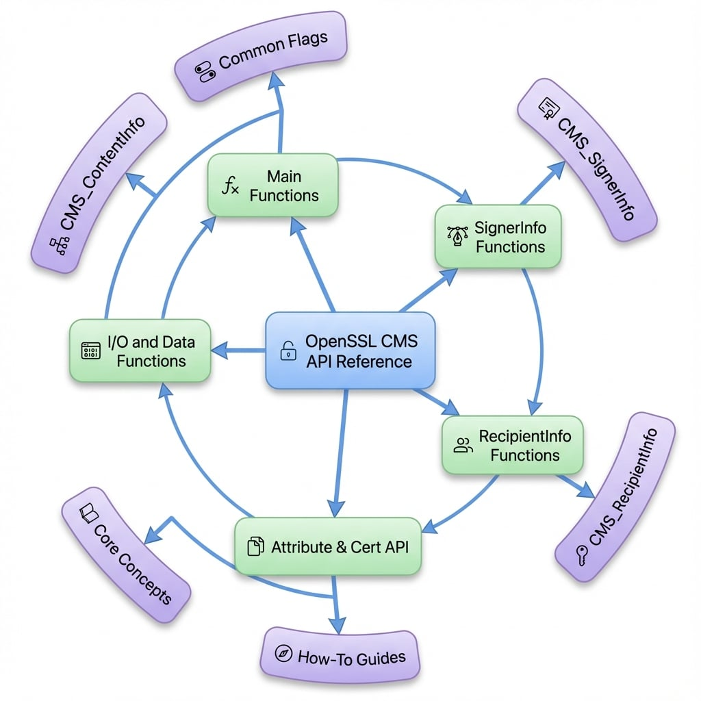

# API 參考文件

本節為整個公開的 OpenSSL Cryptographic Message Syntax (CMS) API 提供了一份完整且可供搜尋的參考文件。它為所有函式提供了詳細的文件，包括那些先前未記載的函式，使其成為開發人員使用此函式庫的權威指南。

此 API 被組織成邏輯群組，以協助您快速找到所需函式。無論您是執行高階操作，還是需要對 CMS 結構進行精細控制，本參考文件都包含了必要的詳細資訊。

關於 CMS 的概念性解釋，請參閱 [核心概念](./concepts.md) 一節。關於以任務為導向的工作流程，請參閱 [操作指南](./guides.md)。

## 函式類別

OpenSSL CMS API 根據功能被組織成數個類別。以下是每個類別的概覽及其詳細文件的連結。

<x-cards data-columns="2">
  <x-card data-title="主要函式" data-icon="lucide:function-square" data-href="/api/main">
    用於常見操作的高階函式，例如簽署、驗證、加密和解密 CMS 訊息。這些是使用最頻繁的函式。
  </x-card>
  <x-card data-title="SignerInfo 函式" data-icon="lucide:pen-tool" data-href="/api/signerinfo">
    用於管理 SignerInfo 結構的函式，包括新增簽署者、管理已簽署和未簽署的屬性，以及執行低階簽章驗證。
  </x-card>
  <x-card data-title="RecipientInfo 函式" data-icon="lucide:users" data-href="/api/recipientinfo">
    用於管理 RecipientInfo 結構的函式。這包括為各種金鑰管理類型（KTRI、KARI 等）新增接收者以及處理解密金鑰。
  </x-card>
  <x-card data-title="屬性與憑證 API" data-icon="lucide:files" data-href="/api/attributes-certs">
    一系列用於管理 CMS 結構內的憑證、憑證撤銷清單 (CRL) 和屬性的函式。
  </x-card>
  <x-card data-title="I/O 與資料函式" data-icon="lucide:binary" data-href="/api/io-data">
    涵蓋資料串流、I/O 操作以及直接管理如 Data、DigestedData 和 CompressedData 等內容類型的函式。
  </x-card>
</x-cards>

## 關鍵資料結構

整個 CMS 功能都圍繞著幾個核心資料結構。理解這些結構是有效使用此 API 的關鍵。下圖說明了這些關鍵結構之間的關係。

<!-- DIAGRAM_IMAGE_START:intro:1:1 -->

<!-- DIAGRAM_IMAGE_END -->

*   **`CMS_ContentInfo`**：CMS 中的頂層結構。它封裝了內容類型和內容本身。所有 CMS 訊息都會被解析到此結構中或從此結構生成。
*   **`CMS_SignerInfo`**：包含與單一簽署者相關的所有資訊，包括其憑證識別碼、簽章演算法、簽章值以及任何已簽署或未簽署的屬性。
*   **`CMS_RecipientInfo`**：包含單一接收者解密內容加密金鑰所需的資訊。根據所使用的金鑰管理技術，有不同類型的 `RecipientInfo` 結構。

## 常用旗標

許多 CMS 函式接受一個 `flags` 引數來修改其行為。這些旗標可以使用位元 OR 運算子 (`|`) 組合。下表列出了最常見的旗標及其用途。

| Flag | Value | Description |
| :--- | :--- | :--- |
| `CMS_TEXT` | `0x1` | 為 `text/plain` 內容類型新增 MIME 標頭。 |
| `CMS_NOCERTS` | `0x2` | 簽署時，不在訊息中包含簽署者的憑證。 |
| `CMS_NO_CONTENT_VERIFY` | `0x4` | 驗證時，不驗證內容簽章。 |
| `CMS_NO_ATTR_VERIFY` | `0x8` | 驗證時，不驗證已簽署屬性上的簽章。 |
| `CMS_NOINTERN` | `0x10` | 驗證時，不在訊息本身中搜尋簽署者的憑證。 |
| `CMS_NO_SIGNER_CERT_VERIFY` | `0x20` | 不驗證簽署者的憑證鏈。 |
| `CMS_DETACHED` | `0x40` | 建立一個分離式簽章，其中內容不包含在 `SignedData` 結構中。 |
| `CMS_BINARY` | `0x80` | 不對內容執行 MIME 標準化。用於二進位資料。 |
| `CMS_NOATTR` | `0x100` | 不包含任何已簽署的屬性。這會建立一個較簡單的簽章，但缺乏如簽署時間等上下文資訊。 |
| `CMS_NOSMIMECAP` | `0x200` | 省略 S/MIME 功能的已簽署屬性。 |
| `CMS_CRLFEOL` | `0x800` | 對於基於文字的 MIME 內容，使用 CRLF 作為換行符。 |
| `CMS_STREAM` | `0x1000` | 表示資料正在以串流方式處理，並啟用串流 I/O 操作。 |
| `CMS_NOCRL` | `0x2000` | 不在 `SignedData` 結構中包含任何 CRL。 |
| `CMS_USE_KEYID` | `0x10000` | 使用主體金鑰識別碼來識別憑證，而非頒發者和序號。 |
| `CMS_DEBUG_DECRYPT` | `0x20000` | 在解密操作期間啟用除錯輸出，以協助診斷錯誤。 |
| `CMS_CADES` | `0x100000` | 為簽章啟用 CAdES (CMS 進階電子簽章) 合規性。 |

## 總結

本 API 參考文件旨在成為使用 OpenSSL CMS 函式庫的開發人員的綜合資源。每個子章節都提供詳細的函式原型、參數說明、回傳值和使用說明。請使用導覽來探索不同的函式類別，並找到您實作所需的特定工具。