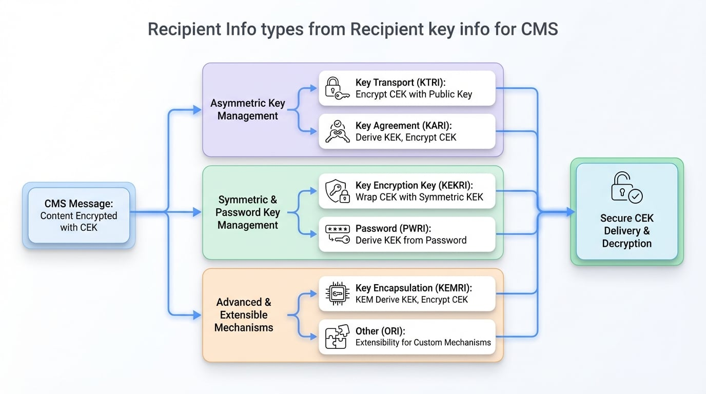

# Recipient Info Types

Within the Cryptographic Message Syntax, the `RecipientInfo` structure is the mechanism for securely delivering the content-encryption key (CEK) to each recipient. This document details the six types of `RecipientInfo` structures, explaining how each one protects and transports the key, enabling you to select the appropriate method for your application's security requirements.

In a CMS `EnvelopedData` structure, the message content is encrypted with a single, randomly generated symmetric key known as the Content Encryption Key (CEK). To ensure that only authorized recipients can access the content, the CEK itself must be securely distributed. This is accomplished by creating a `RecipientInfo` structure for each recipient. Each structure contains a copy of the CEK, encrypted in a way that is unique to and only decryptable by its intended recipient.

<!-- DIAGRAM_IMAGE_START:intro:16:9 -->

<!-- DIAGRAM_IMAGE_END -->

OpenSSL supports six distinct mechanisms for this key management, each identified by a unique type.

## Key Transport Recipient Info (KTRI)

Key Transport is one of the most common methods for distributing a CEK. It uses asymmetric (public-key) cryptography to encrypt the CEK directly with the recipient's public key.

*   **Type Identifier**: `CMS_RECIPINFO_TRANS`
*   **Mechanism**: The sender generates a CEK, encrypts it using the recipient's public key (typically RSA), and places the result in a `KeyTransRecipientInfo` structure. The recipient uses their corresponding private key to decrypt the CEK and then access the message content.
*   **Use Case**: Ideal for standard public key infrastructure (PKI) environments where recipients have X.509 certificates containing RSA, or similar, public keys suitable for encryption.
*   **ASN.1 Structure**: `KeyTransRecipientInfo`

This approach is straightforward and widely supported. The primary function for adding a KTRI recipient is `CMS_add1_recipient_cert()`.

```c
CMS_RecipientInfo *CMS_add1_recipient_cert(CMS_ContentInfo *cms,
                                           X509 *recip, unsigned int flags);
```

## Key Agreement Recipient Info (KARI)

Key Agreement allows two or more parties to generate a shared secret over an insecure channel, which is then used to derive a key-encryption key (KEK) to wrap the CEK.

*   **Type Identifier**: `CMS_RECIPINFO_AGREE`
*   **Mechanism**: The sender generates an ephemeral key pair (e.g., Diffie-Hellman or Elliptic Curve Diffie-Hellman). Using their own private key and the recipient's public key, they derive a shared secret. This secret is used to derive a KEK that encrypts the CEK. The recipient performs the same derivation using their private key and the sender's ephemeral public key.
*   **Use Case**: Suited for protocols based on Diffie-Hellman (DH) or Elliptic Curve Diffie-Hellman (ECDH), providing Perfect Forward Secy if ephemeral keys are used.
*   **ASN.1 Structure**: `KeyAgreeRecipientInfo`

This method is more complex than KTRI but offers advanced security properties.

## Key Encryption Key Recipient Info (KEKRI)

This method uses a pre-shared symmetric key, known as a Key Encryption Key (KEK), to encrypt the CEK.

*   **Type Identifier**: `CMS_RECIPINFO_KEK`
*   **Mechanism**: Both the sender and recipient must already possess a shared symmetric key. The sender uses this KEK to encrypt the CEK, typically using a key-wrapping algorithm like AES Key Wrap. The recipient uses the same KEK to unwrap it. The KEK is identified by a unique key identifier.
*   **Use Case**: Useful in closed systems where symmetric keys can be securely provisioned and managed out-of-band. It avoids the overhead of public-key cryptography.
*   **ASN.1 Structure**: `KEKRecipientInfo`

The primary function for adding a KEKRI recipient is `CMS_add0_recipient_key()`.

```c
CMS_RecipientInfo *CMS_add0_recipient_key(CMS_ContentInfo *cms, int nid,
                                          unsigned char *key, size_t keylen,
                                          unsigned char *id, size_t idlen,
                                          ASN1_GENERALIZEDTIME *date,
                                          ASN1_OBJECT *otherTypeId,
                                          ASN1_TYPE *otherType);
```

## Password Recipient Info (PWRI)

Password-based key management derives a KEK from a shared password or passphrase.

*   **Type Identifier**: `CMS_RECIPINFO_PASS`
*   **Mechanism**: A KEK is derived from a password using a key derivation function (KDF), such as PBKDF2. This KEK is then used to encrypt the CEK. The recipient, who knows the same password, performs the same KDF to re-derive the KEK and decrypt the CEK.
*   **Use Case**: Scenarios where security is based on human-memorable secrets rather than certificates or provisioned keys.
*   **ASN.1 Structure**: `PasswordRecipientInfo`

The function `CMS_add0_recipient_password()` is used to add a PWRI recipient.

```c
CMS_RecipientInfo *CMS_add0_recipient_password(CMS_ContentInfo *cms,
                                               int iter, int wrap_nid,
                                               int pbe_nid,
                                               unsigned char *pass,
                                               ossl_ssize_t passlen,
                                               const EVP_CIPHER *kekciph);
```

## Key Encapsulation Mechanism Recipient Info (KEMRI)

KEMRI is a modern approach for secure key establishment, particularly relevant for post-quantum cryptography. It is a variant of key transport.

*   **Type Identifier**: `CMS_RECIPINFO_KEM`
*   **Mechanism**: A Key Encapsulation Mechanism (KEM) is a suite of algorithms for encapsulating and decapsulating a shared secret. The sender uses the recipient's public key to generate a shared secret and a ciphertext (the encapsulated key). The shared secret is used with a KDF to derive a KEK, which wraps the CEK. The recipient uses their private key to decapsulate the ciphertext, retrieve the same shared secret, and derive the same KEK.
*   **Use Case**: Provides a standardized framework for emerging cryptographic algorithms, especially those designed to be resistant to attacks from quantum computers.
*   **ASN.1 Structure**: `KEMRecipientInfo` (within `OtherRecipientInfo`)

## Other Recipient Info (ORI)

This type serves as an extensibility point for defining new recipient information types that are not covered by the standard set.

*   **Type Identifier**: `CMS_RECIPINFO_OTHER`
*   **Mechanism**: The structure and processing rules are defined by the specific implementation, identified by a unique object identifier (`oriType`). KEMRI is a prominent example of a mechanism implemented using `OtherRecipientInfo`.
*   **Use Case**: Future-proofing the CMS standard by allowing for the integration of novel key management schemes without requiring a new version of the specification.
*   **ASN.1 Structure**: `OtherRecipientInfo`

## Summary of Recipient Types

The table below provides a high-level comparison of the different `RecipientInfo` types.

| Type | Identifier | Key Management | Primary Key Type | Common Use Case |
| :--- | :--- | :--- | :--- | :--- |
| **KTRI** | `CMS_RECIPINFO_TRANS` | Asymmetric Key Transport | RSA Public Key | Standard certificate-based encryption. |
| **KARI** | `CMS_RECIPINFO_AGREE` | Asymmetric Key Agreement | DH/ECDH Public Key | Establishing a shared secret for key derivation. |
| **KEKRI** | `CMS_RECIPINFO_KEK` | Symmetric Key Wrap | Pre-shared Symmetric Key | Systems with pre-provisioned symmetric keys. |
| **PWRI** | `CMS_RECIPINFO_PASS` | Symmetric Password-Based | Password/Passphrase | Security based on shared secrets. |
| **KEMRI**| `CMS_RECIPINFO_KEM` | Key Encapsulation | KEM Public Key | Post-quantum cryptography and modern schemes. |
| **ORI** | `CMS_RECIPINFO_OTHER` | Custom | Varies | Extensibility for new key management mechanisms. |

---

### Further Reading

-   To understand how `RecipientInfo` fits into the overall message structure, see [Content Types](./concepts-content-types.md).
-   For step-by-step instructions on implementing encryption, refer to the [Encryption & Decryption](./guides-encrypting-decrypting.md) guide.
-   For a detailed API reference, visit the [RecipientInfo Functions](./api-recipientinfo.md) documentation.
