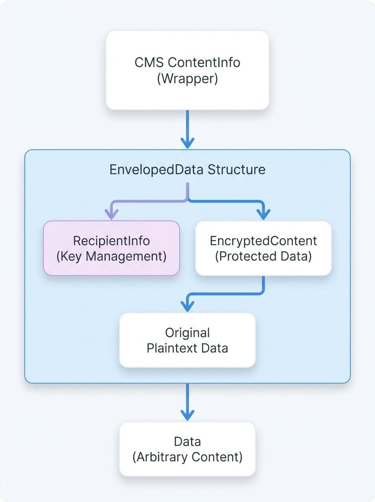

# コアコンセプト

OpenSSL の暗号メッセージ構文 (CMS) ライブラリを効果的に使用するには、まずそのアーキテクチャの設計図を理解することが不可欠です。このドキュメントでは、CMS メッセージの主要なコンポーネント、それらがどのように相互作用するか、そして安全なデジタルメッセージを作成する上でそれぞれが果たす目的について、基礎的な概要を説明します。この概念的なフレームワークは、後続のガイドでの実践的な応用のための準備となります。

## CMS のアーキテクチャ設計図

[RFC 5652](https://tools.ietf.org/html/rfc5652) で規定されている暗号メッセージ構文 (CMS) は、データを保護するための標準です。デジタル署名、メッセージダイジェスト、認証、暗号化など、幅広い暗号操作のための構文を提供します。その最も著名な応用例は、電子メール通信を保護する **S/MIME** (Secure/Multipurpose Internet Mail Extensions) プロトコルです。

その中核として、すべての CMS メッセージは `ContentInfo` 構造体です。この構造体はユニバーサルなラッパーとして機能し、2つの重要な情報を含んでいます：

1.  **Content Type**: どのような種類のデータが内包されているかを示すオブジェクト識別子 (OID)。
2.  **Content**: 指定されたコンテントタイプに従って構造化された実際のデータ。

この階層化された設計により、ネスト (入れ子構造) が可能になり、ある CMS 構造を別の構造の中にラップすることができます。例えば、署名付きメッセージ (`SignedData`) 自体を暗号化し、`SignedData` 構造全体を `EnvelopedData` 構造のコンテンツにすることができます。以下の図は、この階層構造を示しています：

<!-- DIAGRAM_IMAGE_START:architecture:3:4 -->

<!-- DIAGRAM_IMAGE_END -->

## CMS のコンテントタイプ

OpenSSL CMS の実装は、それぞれが特定の暗号目的のために設計された、いくつかの標準的なコンテントタイプをサポートしています。これらのタイプを理解することは、CMS メッセージを構築し、解析するための第一歩です。

各タイプの詳細については、[コンテントタイプ](./concepts-content-types.md) のドキュメントを参照してください。

<x-cards data-columns="3">
  <x-card data-title="Data" data-icon="lucide:file-text">
    最も単純なタイプで、任意のオクテット文字列データを表します。他のタイプの平文コンテンツとして機能します。
  </x-card>
  <x-card data-title="SignedData" data-icon="lucide:pen-square">
    デジタル署名を提供します。元のコンテンツ、署名者に関する情報 (SignerInfo)、およびデジタル署名が含まれます。
  </x-card>
  <x-card data-title="EnvelopedData" data-icon="lucide:mail">
    暗号化による機密性を提供します。暗号化されたコンテンツと、それを復号するために必要な受信者固有の情報 (RecipientInfo) が含まれます。
  </x-card>
  <x-card data-title="DigestedData" data-icon="lucide:hash">
    コンテンツのメッセージダイジェスト (ハッシュ) を保存することで、コンテンツの完全性を提供します。
  </x-card>
  <x-card data-title="EncryptedData" data-icon="lucide:lock">
    対称暗号化されたコンテンツを含みますが、EnvelopedData とは異なり、受信者の鍵管理情報は含まれません。鍵は帯域外で管理する必要があります。
  </x-card>
  <x-card data-title="AuthEnvelopedData" data-icon="lucide:shield-check">
    関連データ付き認証付き暗号 (AEAD) を提供し、機密性と完全性を単一の操作で組み合わせます。
  </x-card>
</x-cards>

## コンテントタイプ内の主要コンポーネント

`SignerInfo` と `RecipientInfo` という2つの重要な構造体は、それぞれ `SignedData` と `EnvelopedData` タイプの操作の中心です。

### SignerInfo: 署名ブロック

`SignerInfo` 構造体は `SignedData` コンテントタイプの中心です。メッセージの各署名者は、1つの `SignerInfo` ブロックを提供します。このブロックには、署名を検証するために必要なすべての情報が含まれています。

*   **署名者識別子**: 発行者とシリアル番号、またはサブジェクトキー識別子によって、署名者の証明書を一意に識別します。
*   **ダイジェストアルゴリズム**: 署名前にメッセージコンテンツをハッシュするために使用されるアルゴリズム (例: SHA-256)。
*   **署名アルゴリズム**: デジタル署名を作成するために使用されるアルゴリズム (例: RSA)。
*   **署名付き属性**: コンテンツダイジェストと共に署名される認証済み属性のセット。これには通常、コンテントタイプと署名時刻が含まれます。
*   **署名値**: 実際のデジタル署名のオクテット文字列。
*   **非署名属性**: カウンター署名など、署名計算の一部ではないオプションの属性。

### RecipientInfo: 復号の鍵

`RecipientInfo` 構造体は `EnvelopedData` と `AuthEnvelopedData` の中心です。特定の受信者がメッセージを復号するために必要な情報を提供します。メッセージには、受信者ごとに1つずつ、複数の `RecipientInfo` 構造体を含めることができます。

CMS は、コンテンツ暗号化鍵 (CEK) を受信者に配信するためのいくつかの方法を定義しており、それぞれが異なる `RecipientInfo` タイプに対応しています。タイプの選択は、受信者が使用するクレデンシャルの種類に依存します。

各タイプの完全な説明については、[Recipient Info のタイプ](./concepts-recipient-info-types.md) のドキュメントをご覧ください。

| タイプ | 定数 | 説明 | 一般的なクレデンシャル |
| :---- | :---------------------- | :------------------------------------------------------------------------------------------------------ | :------------------------ |
| KTRI | `CMS_RECIPINFO_TRANS` | **鍵トランスポート**: CEK が受信者の公開鍵 (例: RSA) で暗号化されます。 | X.509 証明書 (RSA) |
| KARI | `CMS_RECIPINFO_AGREE` | **鍵合意**: 受信者と送信者の鍵 (例: DH/ECDH) を使用して共有秘密が導出されます。 | X.509 証明書 (DH/EC) |
| KEKRI | `CMS_RECIPINFO_KEK` | **鍵暗号化鍵**: CEK が事前共有の対称鍵でラップされます。 | 対称鍵 |
| PWRI | `CMS_RECIPINFO_PASS` | **パスワード**: CEK がパスワードから導出されます。 | パスワード / パスフレーズ |
| KEMRI | `CMS_RECIPINFO_KEM` | **鍵カプセル化メカニズム**: 鍵交換のための耐量子メカニズム。 | ポスト量子鍵 |
| ORI | `CMS_RECIPINFO_OTHER` | **その他**: カスタムまたは将来の受信者タイプのためのプレースホルダー。 | カスタム |

## `openssl cms` コマンドとの関係

`openssl cms` コマンドラインツールは、CMS ライブラリ関数への高レベルのインターフェースです。その主要な各操作は、特定の CMS コンテントタイプの作成または処理に直接対応しています。このマッピングを理解することで、コマンドラインのアクションが基盤となる API にどのように変換されるかのコンテキストが提供されます。

| `openssl cms` コマンド | 対応する CMS コンテントタイプ | コア API 関数 |
| :---------------------------- | :----------------------------- | :------------------------------------------------- |
| `-sign`, `-verify`, `-resign` | `SignedData` | `CMS_sign()`, `CMS_verify()` |
| `-encrypt`, `-decrypt` | `EnvelopedData` | `CMS_encrypt()`, `CMS_decrypt()` |
| `-digest_create`, `-digest_verify` | `DigestedData` | `CMS_digest_create()`, `CMS_digest_verify()` |
| `-EncryptedData_encrypt`, `-EncryptedData_decrypt` | `EncryptedData` | `CMS_EncryptedData_encrypt()`, `CMS_EncryptedData_decrypt()` |
| `-compress`, `-uncompress` | `CompressedData` | `CMS_compress()`, `CMS_uncompress()` |
| `-data_create` | `Data` | `CMS_data_create()` |

## まとめ

暗号メッセージ構文は、データに暗号保護を適用するための構造化された階層的なフレームワークを提供します。その中心は `ContentInfo` 構造体であり、`SignedData` や `EnvelopedData` のような様々なコンテントタイプをラップします。これらは、署名と暗号鍵を管理するために `SignerInfo` と `RecipientInfo` に依存しています。

この概念的な基礎をもとに、より具体的なトピックを探求する準備ができました：

<x-cards data-columns="2">
  <x-card data-title="クイックスタート" data-icon="lucide:rocket" data-href="/quick-start">
    最小限の理論で一般的な CMS 操作を実行するための実践的なガイド。
  </x-card>
  <x-card data-title="コンテントタイプ" data-icon="lucide:box" data-href="/concepts/content-types">
    主要な各 CMS コンテントタイプの詳細な調査。
  </x-card>
  <x-card data-title="Recipient Info のタイプ" data-icon="lucide:key-round" data-href="/concepts/recipient-info-types">
    受信者の鍵管理のための様々な方法に関する詳細な解説。
  </x-card>
  <x-card data-title="CLI ツール (openssl cms)" data-icon="lucide:terminal" data-href="/command-line">
    コマンドラインインターフェースの包括的なリファレンス。
  </x-card>
</x-cards>