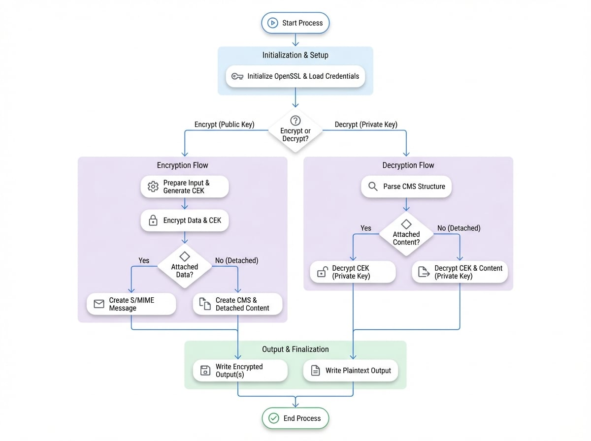

# 加密與解密

要安全地傳輸敏感資訊，需要強健的加密機制，確保只有授權的收件者才能存取內容。本指南提供系統化、逐步的工作流程，說明如何使用 OpenSSL 對 CMS `EnvelopedData` 內容類型的實作來加密與解密資料。您將學習處理加密訊息的標準流程，以及較不常見的分離式資料工作流程。

此處概述的程序主要涉及 `EnvelopedData` 內容類型，它封裝了加密內容及一或多個收件者識別碼。每個收件者項目都包含一個內容加密金鑰，該金鑰已為特定收件者單獨加密，通常是使用其公鑰。下圖說明了此一般概念。

<!-- DIAGRAM_IMAGE_START:flowchart:4:3 -->

<!-- DIAGRAM_IMAGE_END -->

關於底層結構的更詳細說明，請參閱 [內容類型](./concepts-content-types.md) 和 [Recipient Info 類型](./concepts-recipient-info-types.md) 文件。

## 標準工作流程：附加式資料

最常見的使用案例是建立單一的 S/MIME 訊息，其中加密內容包含在 CMS 結構內。以下各節將詳細說明建立和解密這些訊息的過程。

### 加密過程

加密工作流程會產生一個 `EnvelopedData` 類型的 `CMS_ContentInfo` 結構。此結構包含加密後的資料以及每個收件者解密所需的資訊。

此操作的主要函式是 `CMS_encrypt()`。它負責協調整個過程：產生一個對稱式內容加密金鑰 (CEK)、用 CEK 加密資料、為每個收件者使用其公鑰加密 CEK，並將這些元件組合成最終的結構。

邏輯步驟如下：
1.  初始化 OpenSSL 函式庫。
2.  載入每個預定收件者的公開憑證。
3.  建立一個 `STACK_OF(X509)` 並將每個收件者的憑證加入其中。
4.  使用 `BIO` 開啟要加密的輸入資料。
5.  呼叫 `CMS_encrypt()`，提供收件者堆疊、輸入 `BIO`、一個對稱式加密演算法（例如 `EVP_des_ede3_cbc()`）以及任何必要的旗標。
6.  開啟一個輸出 `BIO` 以寫入結果。
7.  使用 `SMIME_write_CMS()` 寫入完整的 S/MIME 訊息。
8.  清理所有已分配的資源。

以下範例示範一個完整的加密操作。

```c cms_enc.c
/* 簡易 S/MIME 加密範例 */
#include <openssl/pem.h>
#include <openssl/cms.h>
#include <openssl/err.h>

int main(int argc, char **argv)
{
    BIO *in = NULL, *out = NULL, *tbio = NULL;
    X509 *rcert = NULL;
    STACK_OF(X509) *recips = NULL;
    CMS_ContentInfo *cms = NULL;
    int ret = EXIT_FAILURE;

    /*
     * 僅適用於 OpenSSL 1.0.0 及更新版本：
     * 若要進行串流處理，請設定 CMS_STREAM
     */
    int flags = CMS_STREAM;

    OpenSSL_add_all_algorithms();
    ERR_load_crypto_strings();

    /* 讀取收件者憑證 */
    tbio = BIO_new_file("signer.pem", "r");
    if (!tbio)
        goto err;
    rcert = PEM_read_bio_X509(tbio, NULL, 0, NULL);
    if (!rcert)
        goto err;

    /* 建立收件者 STACK 並將收件者憑證加入其中 */
    recips = sk_X509_new_null();
    if (!recips || !sk_X509_push(recips, rcert))
        goto err;

    /* rcert 現在是 recips 的一部分，將隨其一起釋放 */
    rcert = NULL;

    /* 開啟要加密的內容 */
    in = BIO_new_file("encr.txt", "r");
    if (!in)
        goto err;

    /* 加密內容 */
    cms = CMS_encrypt(recips, in, EVP_des_ede3_cbc(), flags);
    if (!cms)
        goto err;

    out = BIO_new_file("smencr.txt", "w");
    if (!out)
        goto err;

    /* 寫出 S/MIME 訊息 */
    if (!SMIME_write_CMS(out, cms, in, flags))
        goto err;

    printf("Encryption Successful\n");
    ret = EXIT_SUCCESS;

err:
    if (ret != EXIT_SUCCESS) {
        fprintf(stderr, "Error Encrypting Data\n");
        ERR_print_errors_fp(stderr);
    }

    CMS_ContentInfo_free(cms);
    X509_free(rcert);
    OSSL_STACK_OF_X509_free(recips);
    BIO_free(in);
    BIO_free(out);
    BIO_free(tbio);
    return ret;
}
```

### 解密過程

解密是反向操作。收件者使用其私鑰從其對應的 `RecipientInfo` 結構中解密內容加密金鑰 (CEK)。一旦 CEK 被復原，它就會被用來解密訊息內容。

`CMS_decrypt()` 函式處理此過程。它需要收件者的私鑰及其匹配的憑證，以定位正確的 `RecipientInfo` 結構並執行解密。

邏輯步驟如下：
1.  初始化 OpenSSL 函式庫。
2.  載入收件者的私鑰 (`EVP_PKEY`) 和公開憑證 (`X509`)。
3.  使用 `BIO` 開啟加密的 S/MIME 訊息。
4.  使用 `SMIME_read_CMS()` 將訊息解析為 `CMS_ContentInfo` 結構。
5.  為解密後的明文開啟一個輸出 `BIO`。
6.  呼叫 `CMS_decrypt()`，提供 `CMS_ContentInfo` 結構、收件者的私鑰、憑證以及輸出 `BIO`。
7.  清理所有已分配的資源。

以下範例示範一個完整的解密操作。

```c cms_dec.c
/* 簡易 S/MIME 解密範例 */
#include <openssl/pem.h>
#include <openssl/cms.h>
#include <openssl/err.h>

int main(int argc, char **argv)
{
    BIO *in = NULL, *out = NULL, *tbio = NULL;
    X509 *rcert = NULL;
    EVP_PKEY *rkey = NULL;
    CMS_ContentInfo *cms = NULL;
    int ret = EXIT_FAILURE;

    OpenSSL_add_all_algorithms();
    ERR_load_crypto_strings();

    /* 讀取收件者憑證和私鑰 */
    tbio = BIO_new_file("signer.pem", "r");
    if (!tbio)
        goto err;
    rcert = PEM_read_bio_X509(tbio, NULL, 0, NULL);
    if (BIO_reset(tbio) < 0)
        goto err;
    rkey = PEM_read_bio_PrivateKey(tbio, NULL, 0, NULL);
    if (!rcert || !rkey)
        goto err;

    /* 開啟要解密的 S/MIME 訊息 */
    in = BIO_new_file("smencr.txt", "r");
    if (!in)
        goto err;

    /* 解析訊息 */
    cms = SMIME_read_CMS(in, NULL);
    if (!cms)
        goto err;

    out = BIO_new_file("decout.txt", "w");
    if (!out)
        goto err;

    /* 解密 S/MIME 訊息 */
    if (!CMS_decrypt(cms, rkey, rcert, NULL, out, 0))
        goto err;

    printf("Decryption Successful\n");
    ret = EXIT_SUCCESS;

err:
    if (ret != EXIT_SUCCESS) {
        fprintf(stderr, "Error Decrypting Data\n");
        ERR_print_errors_fp(stderr);
    }

    CMS_ContentInfo_free(cms);
    X509_free(rcert);
    EVP_PKEY_free(rkey);
    BIO_free(in);
    BIO_free(out);
    BIO_free(tbio);
    return ret;
}
```

## 進階工作流程：分離式資料

在某些情況下，加密內容可能會與 CMS 元資料結構分開處理。這被稱為分離式資料。加密時，使用 `CMS_DETACHED` 旗標來建立一個省略了加密內容的 `CMS_ContentInfo` 結構，該內容必須儲存在其他地方。這是一個不常見的使用案例。

### 使用分離式資料進行加密

當將 `CMS_DETACHED` 旗標與 `CMS_encrypt()` 一起使用時，該函式仍會執行加密，但會將產生的密文寫入一個獨立的 `BIO`。返回的 `CMS_ContentInfo` 結構包含所有必要的收件者資訊，但本身不含資料。

此過程與標準加密相似，但有以下主要區別：
-   必須包含 `CMS_DETACHED` 旗標。
-   需要一個獨立的 `BIO`（範例中的 `dout`）來擷取加密後的輸出。
-   使用 `CMS_final()` 函式來完成串流加密操作。
-   產生的 `CMS_ContentInfo` 結構（不含內容）被寫入一個檔案，而加密後的資料則被寫入另一個檔案。

```c cms_denc.c
/* S/MIME 分離式資料加密範例 */
#include <openssl/pem.h>
#include <openssl/cms.h>
#include <openssl/err.h>

int main(int argc, char **argv)
{
    BIO *in = NULL, *out = NULL, *tbio = NULL, *dout = NULL;
    X509 *rcert = NULL;
    STACK_OF(X509) *recips = NULL;
    CMS_ContentInfo *cms = NULL;
    int ret = EXIT_FAILURE;

    int flags = CMS_STREAM | CMS_DETACHED;

    OpenSSL_add_all_algorithms();
    ERR_load_crypto_strings();

    /* 讀取收件者憑證 */
    tbio = BIO_new_file("signer.pem", "r");
    if (!tbio)
        goto err;
    rcert = PEM_read_bio_X509(tbio, NULL, 0, NULL);
    if (!rcert)
        goto err;

    /* 建立收件者 STACK */
    recips = sk_X509_new_null();
    if (!recips || !sk_X509_push(recips, rcert))
        goto err;
    rcert = NULL;

    /* 開啟要加密的內容和分離式輸出 */
    in = BIO_new_file("encr.txt", "r");
    dout = BIO_new_file("smencr.out", "wb");
    if (in == NULL || dout == NULL)
        goto err;

    /* 加密內容 */
    cms = CMS_encrypt(recips, in, EVP_des_ede3_cbc(), flags);
    if (!cms)
        goto err;

    out = BIO_new_file("smencr.pem", "w");
    if (!out)
        goto err;

    /* 完成串流加密，將密文寫入 dout */
    if (!CMS_final(cms, in, dout, flags))
        goto err;

    /* 寫出不含內容的 CMS 結構 */
    if (!PEM_write_bio_CMS(out, cms))
        goto err;

    ret = EXIT_SUCCESS;
err:
    if (ret != EXIT_SUCCESS) {
        fprintf(stderr, "Error Encrypting Data\n");
        ERR_print_errors_fp(stderr);
    }

    CMS_ContentInfo_free(cms);
    X509_free(rcert);
    OSSL_STACK_OF_X509_free(recips);
    BIO_free(in);
    BIO_free(out);
    BIO_free(dout);
    BIO_free(tbio);
    return ret;
}
```

### 使用分離式資料進行解密

要解密帶有分離式資料的訊息，您必須同時提供 `CMS_ContentInfo` 結構和包含加密內容的獨立檔案。`CMS_decrypt()` 函式為此接受一個額外的 `BIO` 參數 (`dcont`)。

與標準解密過程的主要區別如下：
-   從其檔案（例如 `.pem` 檔案）中讀取 `CMS_ContentInfo` 結構。
-   為分離的加密內容開啟一個獨立的 `BIO`。
-   此內容 `BIO` 作為 `dcont` 參數傳遞給 `CMS_decrypt()`。

```c cms_ddec.c
/* S/MIME 分離式資料解密範例 */
#include <openssl/pem.h>
#include <openssl/cms.h>
#include <openssl/err.h>

int main(int argc, char **argv)
{
    BIO *in = NULL, *out = NULL, *tbio = NULL, *dcont = NULL;
    X509 *rcert = NULL;
    EVP_PKEY *rkey = NULL;
    CMS_ContentInfo *cms = NULL;
    int ret = EXIT_FAILURE;

    OpenSSL_add_all_algorithms();
    ERR_load_crypto_strings();

    /* 讀取收件者憑證和私鑰 */
    tbio = BIO_new_file("signer.pem", "r");
    if (!tbio)
        goto err;
    rcert = PEM_read_bio_X509(tbio, NULL, 0, NULL);
    if (BIO_reset(tbio) < 0)
        goto err;
    rkey = PEM_read_bio_PrivateKey(tbio, NULL, 0, NULL);
    if (!rcert || !rkey)
        goto err;

    /* 開啟包含 EnvelopedData 結構的 PEM 檔案 */
    in = BIO_new_file("smencr.pem", "r");
    if (!in)
        goto err;

    /* 解析 PEM 內容 */
    cms = PEM_read_bio_CMS(in, NULL, 0, NULL);
    if (!cms)
        goto err;

    /* 開啟包含分離式內容的檔案 */
    dcont = BIO_new_file("smencr.out", "rb");
    if (dcont == NULL)
        goto err;

    out = BIO_new_file("encrout.txt", "w");
    if (!out)
        goto err;

    /* 使用分離式內容解密 S/MIME 訊息 */
    if (!CMS_decrypt(cms, rkey, rcert, dcont, out, 0))
        goto err;

    ret = EXIT_SUCCESS;

err:
    if (ret != EXIT_SUCCESS) {
        fprintf(stderr, "Error Decrypting Data\n");
        ERR_print_errors_fp(stderr);
    }

    CMS_ContentInfo_free(cms);
    X509_free(rcert);
    EVP_PKEY_free(rkey);
    BIO_free(in);
    BIO_free(out);
    BIO_free(tbio);
    BIO_free(dcont);
    return ret;
}
```

## 總結

本指南對使用 OpenSSL CMS API 進行加密和解密的工作流程進行了完整且條理分明的概述。您已了解如何處理標準的附加式資料和較不常見的分離式資料情境。透過遵循這些結構化的範例，您可以在您的應用程式中可靠地實作安全的資料交換。

有關所用函式的更詳細資訊，請查閱 [API 參考](./api.md) 部分中的相關條目。此外，還提供相關主題的額外指南：

<x-cards data-columns="2">
  <x-card data-title="簽署與驗證" data-icon="lucide:pen-square" data-href="/guides/signing-verifying">
    了解如何建立與驗證 CMS 訊息上的數位簽章。
  </x-card>
  <x-card data-title="API 參考" data-icon="lucide:book-text" data-href="/api">
    探索完整的 OpenSSL CMS API 以進行進階操作。
  </x-card>
</x-cards>