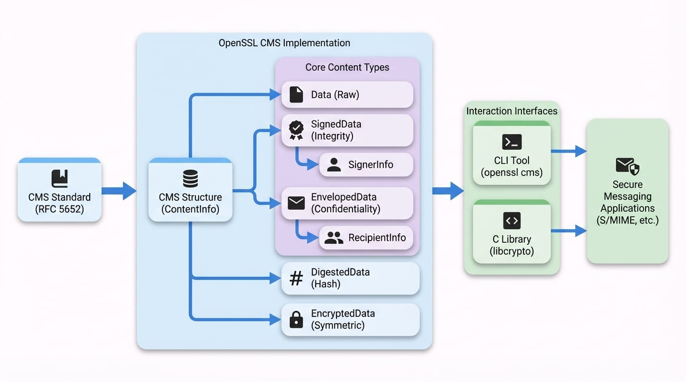

このドキュメントでは、Cryptographic Message Syntax (CMS) の目的、S/MIME のようなセキュアメッセージングアプリケーションにおけるその役割、そして OpenSSL CMS ライブラリの高レベルアーキテクチャについて説明します。最後まで読むことで、CMS メッセージの基本的な構成要素と、それらがどのように組み合わされているかを理解できるでしょう。

# 概要

[RFC 5652](https://tools.ietf.org/html/rfc5652) で規定されている Cryptographic Message Syntax (CMS) は、暗号技術を用いてデータを保護するための標準です。これは、デジタル署名、メッセージダイジェスト、認証、暗号化など、さまざまな暗号操作のための構文を定義しています。CMS は、電子メールの署名や暗号化に使用される Secure/Multipurpose Internet Mail Extensions (S/MIME) のようなセキュアメッセージング標準の基礎となっています。

OpenSSL の CMS モジュールは、この標準の包括的で柔軟な実装を提供しており、C 言語 API と強力なコマンドラインインターフェース (`openssl cms`) の両方からアクセスできます。

## CMS の目的

CMS は、データとそれに関連する暗号情報をカプセル化する「ラッパー」フォーマットを提供します。これにより、自己完結型のセキュアなメッセージを作成し、安全でないネットワーク上で送信することが可能になります。CMS の主要な機能は以下の通りです。

*   **データ完全性:** データが転送中に改ざんされていないことを保証します。通常はデジタル署名を使用します。
*   **認証:** 送信者の身元を確認します。
*   **機密性:** データを暗号化し、許可された受信者のみが閲覧できるようにします。
*   **否認防止:** 特定の送信者がメッセージを作成したことを証明し、後でそれを否定できないようにします。

## 高レベルアーキテクチャ

CMS 構造の中核は `ContentInfo` オブジェクトです。このオブジェクトはコンテナとして機能し、以下の2つの重要な情報を保持します。

1.  **コンテンツタイプ:** 適用される暗号保護の種類（例：署名付きデータ、エンベロープ化データ）を特定する識別子。
2.  **コンテンツ:** 指定されたコンテンツタイプに従って構造化された実際のデータ。

CMS の強みは、そのモジュラー設計にあります。異なるコンテンツタイプをネストさせることで、署名してから暗号化するようなメッセージを作成するなど、暗号操作を組み合わせることができます。

以下の図は、`ContentInfo` コンテナと、そのさまざまなコンテンツタイプとの関係を示しています。

<!-- DIAGRAM_IMAGE_START:architecture:16:9 -->

<!-- DIAGRAM_IMAGE_END -->

### 主要なコンテンツタイプ

OpenSSL の CMS 実装は、それぞれが異なる目的を持ついくつかの標準コンテンツタイプをサポートしています。これらのタイプを理解することは、ライブラリを効果的に使用するための基本です。

| コンテンツタイプ | 説明 | 一般的な使用例 |
| :--- | :--- | :--- |
| **Data** | 任意のデータのためのシンプルなラッパーで、暗号保護はありません。ネストされた構造の最も内側のコンテンツとしてよく使用されます。 | 署名や暗号化の前に元のメッセージをカプセル化する。 |
| **SignedData** | データと、1人以上の署名者によるデジタル署名を含みます。認証、完全性、否認防止を提供します。 | 文書や電子メールの作成者を検証する。 |
| **EnvelopedData** | 暗号化されたデータと、1人以上の受信者がそれを復号するための情報を含みます。機密性を提供します。 | 複数の受信者に機密メッセージを送信する。 |
| **DigestedData** | データとそのデータのメッセージダイジェスト（ハッシュ）を含みます。基本的な形式の完全性チェックを提供します。 | ファイルがダウンロード中に破損していないことを確認する。 |
| **EncryptedData** | 対称鍵で暗号化されたデータを含みます。`EnvelopedData` とは異なり、鍵管理のための受信者情報は含まれません。 | 鍵配送が別途処理される場合の単純な対称暗号化。 |
| **AuthEnvelopedData** | 認証付き暗号（AEAD）を提供し、機密性と完全性を単一の効率的な操作で組み合わせます。 | 機密性と真正性の両方が重要なデータを保護する。 |
| **CompressedData** | 圧縮されたデータを含みます。このタイプは、メッセージのサイズを小さくするために、暗号化の前によく使用されます。 | 大きな添付ファイルを圧縮してから暗号化して送信する。 |

各タイプのより詳細な説明については、[主要な概念](./concepts-content-types.md)セクションを参照してください。

### 署名者と受信者

主要なコンテンツタイプの中には、他に2つの重要な構造があります。

*   `SignerInfo`: `SignedData` 構造内で使用されます。各 `SignerInfo` オブジェクトには、単一の署名者の署名と関連情報が含まれます。これには、署名者の証明書識別子や署名付き属性のハッシュなどが含まれます。1つのメッセージには複数の署名者を含めることができ、それぞれが個別の `SignerInfo` 構造で表されます。

*   `RecipientInfo`: `EnvelopedData` 構造内で使用されます。各 `RecipientInfo` オブジェクトには、単一の受信者のための暗号化されたコンテンツ暗号化キーが含まれます。この設計により、メッセージは一度だけ暗号化され、複数の受信者がそれぞれ自身の秘密鍵を使用して復号できるようになります。CMS はさまざまな鍵管理方法をサポートしており、これらは[受信者情報の種類](./concepts-recipient-info-types.md)で説明されています。

## ライブラリ vs. コマンドラインツール

OpenSSL は、CMS モジュールを操作するための主要な方法を2つ提供しています。

1.  **`openssl cms` コマンドラインツール:** シェルから直接、ファイルの署名、検証、暗号化、復号などの一般的な CMS 操作を実行するための多機能ユーティリティです。スクリプト作成や手動タスクに最適です。

2.  **C ライブラリ (`libcrypto`):** CMS 実装の全機能を公開する豊富な API です。これは、セキュアメッセージング機能を自身の C/C++ アプリケーションに直接統合する必要がある開発者向けであり、CMS 構造のあらゆる側面をきめ細かく制御できます。

コマンドラインツールは C ライブラリの直上に構築されており、そのオプションは多くの場合、API 関数やフラグに直接対応しています。例えば、`openssl cms -sign` を実行すると、内部的に `CMS_sign()` 関数が呼び出されます。このドキュメントは、両者の間のギャップを埋め、コマンドラインに慣れているユーザーが API に移行したり、その逆を行ったりするのを助けることを目的としています。

## このドキュメントの歩き方

このドキュメントは、高レベルの概念から実践的な実装の詳細までを案内するように構成されています。

<x-cards data-columns="2">
  <x-card data-title="クイックスタート" data-icon="lucide:rocket" data-href="/quick-start">
    実践的な導入として、このガイドでは最も一般的な操作のための即座に役立つ実践例を提供します。
  </x-card>
  <x-card data-title="主要な概念" data-icon="lucide:book-open" data-href="/concepts">
    より深い理論的理解のために、このセクションでは CMS のアーキテクチャ構成要素を詳述します。
  </x-card>
  <x-card data-title="ハウツーガイド" data-icon="lucide:wrench" data-href="/guides">
    タスク指向の手順として、これらのガイドでは特定のユースケースのためのステップバイステップのワークフローを提供します。
  </x-card>
  <x-card data-title="API リファレンス" data-icon="lucide:library" data-href="/api">
    詳細な技術情報として、このセクションでは API のすべての関数に関する包括的なリファレンスを提供します。
  </x-card>
</x-cards>

---

### まとめ

*   **CMS は標準です:** 署名や暗号化などの暗号保護をデータに適用するための多機能な構文（RFC 5652）を提供します。
*   **ラッパーシステムです:** 中核となる `ContentInfo` 構造が、データをさまざまな `Content Types`（例：`SignedData`, `EnvelopedData`）でラップして保護します。
*   **OpenSSL は完全なサポートを提供します:** 機能は、柔軟な `openssl cms` コマンドラインツールと包括的な C ライブラリ API を通じて利用可能です。
*   **主要な構造:** `SignerInfo` と `RecipientInfo` は、それぞれ複数署名者および複数受信者の機能を可能にします。