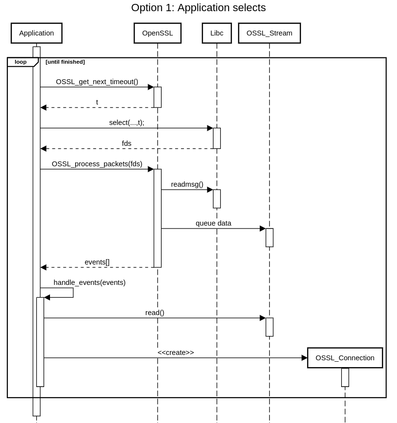
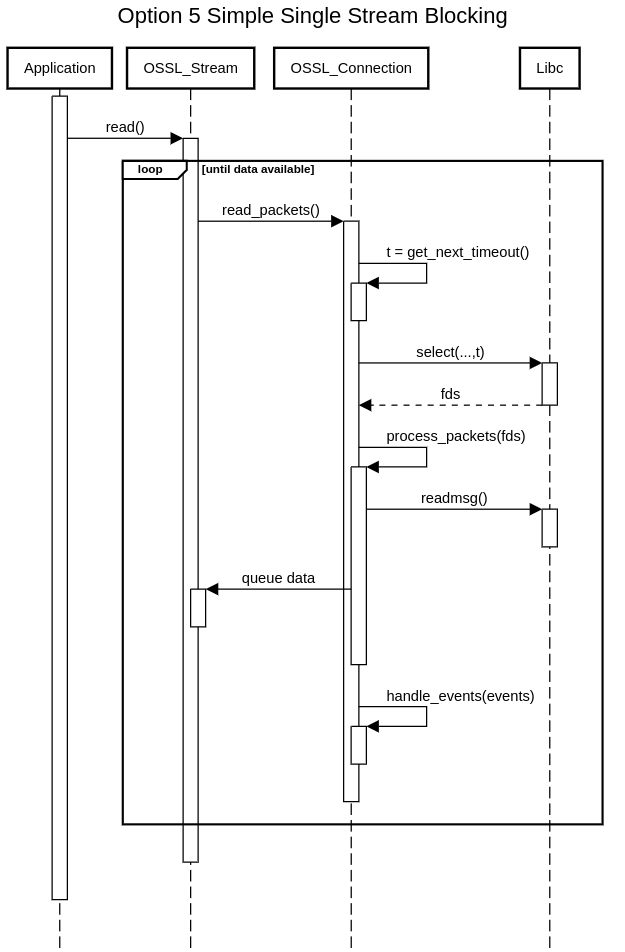
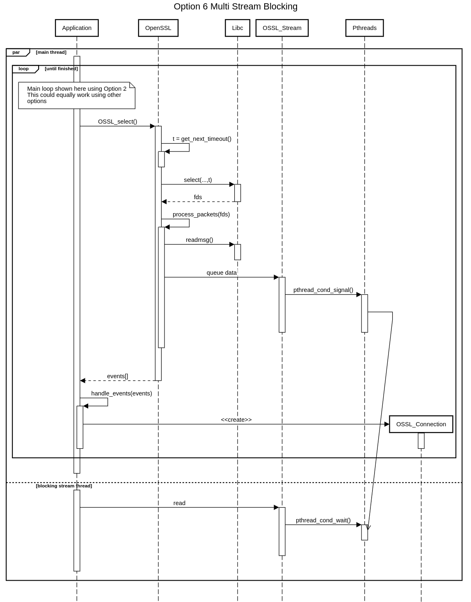
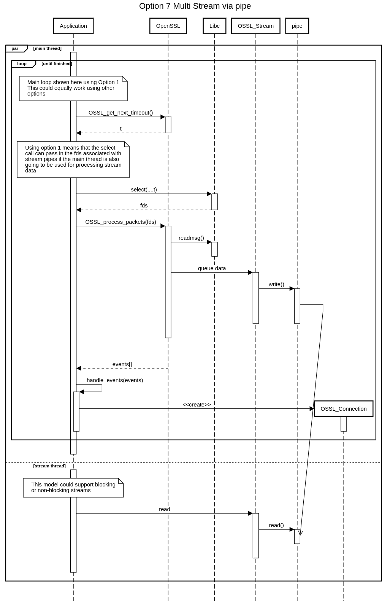

# Design Problem: Event Loop

Applications need to be able to react to events on:

* Sockets
* Connections
* Streams
* Timers

Only the OpenSSL library can supply the events for Connections and Streams.
Events on sockets and timers ultimately come from a system source - the
application may want to receive the event directly from the system, or from
OpenSSL.

For the MVP a blocking mode on top of one of the options below is likely to be
required because that’s the default mode for `s_client`.

## Candidate Solution: Application Selects

In this approach the application "selects" (or whatever alternative function
the applications wishes to use) on the socket and asks OpenSSL to process
incoming packets when they arrive and tell it about any connection/stream
events. The application implements the event loop.  Other calls have to be made
to deal with each of the event possibilities. For timers, OpenSSL supplies a
function to return how long until the next timer event so that the application
knows how long to wait.

Pros:

* The application has full control over the event loop and can implement it in
whichever way most makes sense to the application
* Closest solution to the current API for SSL/TLS/DTLS
* Enables the application to handle interaction with the network layer - which
could be abstracted from OpenSSL via BIOs etc

Cons:

* Requires a lot of "boiler plate" code to get anything working
* The application has to handle timers itself (unlike applications written for
SSL/TLS)
* Not so easy to write the simplest application that want it to "just work"

## Candidate Solution: OSSL_select()

OpenSSL listens on sockets, de-multiplexes to connections/streams and passes
relevant information back to the application OpenSSL implements an internal
socket/timer/connection event processor, e.g. an `OSSL_select()` call.
When an application calls `OSSL_select()` it gets back a set of streams to
read/write from.  Most connection and timer events are processed internally -
some are made available to the application e.g. new connection. On new
connections the application has to create the new connection objects itself e.g.
via some kind of `accept` function.

Pros:

* Hides a lot of complexity from the application
* Timers etc can be handled internally to OpenSSL
* Various events can be handled automatically
* Removes a lot of "boiler plate" code

Cons:

* Less control for the application. It has no choice but to allow OpenSSL to
"select" on the socket.
* Fewer options for the application to abstract away network details from
OpenSSL

 Sequence Diagram")

## Candidate Solution: OSSL_select() extended

This is the same as the OSSL_select() option above but most/all connection
events are processed automatically.  E.g. instead of a new connection event, it
creates the new SSL object for the application.

Pros:

* As per OSSL_select() option above
* Even more complexity is hidden from the application and handled automatically

Cons:

* As per OSSL_select() option above
* Even less control for the application about exactly when connections are
accepted, etc.

 extended Sequence Diagram")

## Candidate Solution: OSSL_select() simplified

This is the same as the OSSL_select() option above except events are not
processed automatically. The application has to call OpenSSL back to process
anything. In particular, OpenSSL does not demultiplex to streams. This differs
from option 1 in that OpenSSL calls select() or poll().

Pros:

* As per OSSL_select() option above
* More control for the application in how to respond to events

Cons:

* As per OSSL_select() option above
* More complexity and bolier plate is required in the application

 simplified Sequence Diagram")

## Candidate Solution: Simple Single Stream Blocking

In this solution the entire event loop is in OpenSSL. Possibly there may be
options to have callbacks for events. Possibly the implementation could use
threads (in a similar manner to MSQUIC).  This option by itself probably is not
sufficient for the full implementation but is a viable path to a blocking mode.

Pros:

* Very simple for the application
* Enables a simple "blocking" mode
* Fewer APIs and could be simpler to implement

Cons:

* Probably unsuitable for a "full" QUIC implementation
* Very unlike our existing APIs
* Very little application control

## Candidate Solution: Multi Stream Blocking (pthread)

Streams implement blocking via pthread_cond_wait()/pthread_cond_signal() or
similar. Can be used in conjunction with any of the first four options above to
add blocking mode support.

## Candidate Solution: Multi Stream via pipe

Streams are implemented via a pipe/socket pair which allows the application to
`select()` on them in addition to the connection fd.  This will have
multi-platform issues and likely performance issues. Probably most suitable for
use in conjunction with the first option above.

Pros:

* As per Application Selects option above
* Gives an fd per stream which means that applications used to an fd per stream
(connection) in TLS can work in a similar way
* Makes implementing blocking straight forward

Cons:

* As per Application Selects option above
* Probably will have multi-platform issues
* Likely to be performance issues

