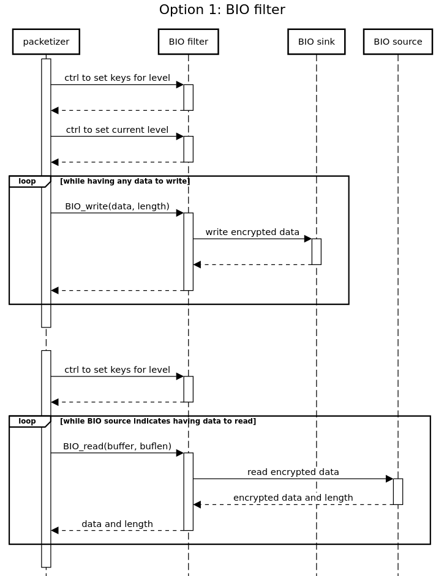
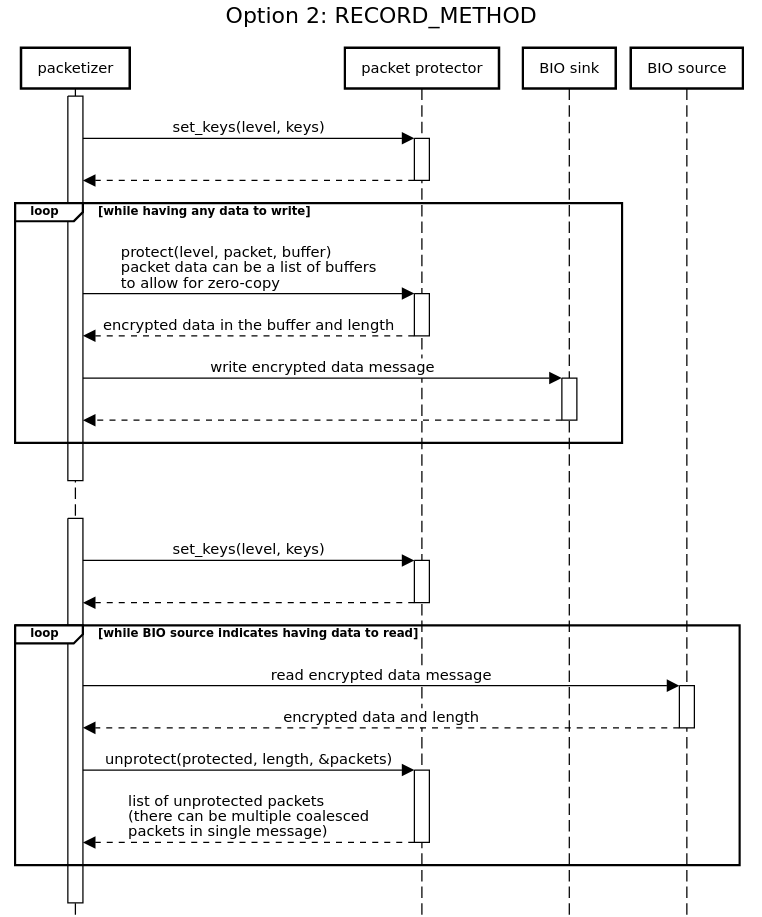

Design Problem: Record Layer
============================

* BIO filter
    * Later exposed via provider
    * Ctrls
* RECORD METHOD structure
    * Later exposed via provider
    * Could be individual callback mechanism
    * PARAMS + arguments

The record layer transmission is a simple layer which takes data from
upper levels, adds protection and (possibly) record headers and passes it
to the next layer for sending. Receiving packets is the opposite
operation: data is received from the network layer, protection is removed
and plaintext data is passed to the upper layers. The record layer API
needs to be universal - it needs to work for TLS, DTLS, KTLS and QUIC.

Definition of _single-copy_: Given there needs to happen an encryption
or decryption to protect or unprotect the data send or received, a copy
of the data (in the transformed form) is always created. Thus the
usual term of _zero-copy_ does not make sense here and we use the term
_single-copy_.

Candidate Solution: BIO filter
------------------------------

We have an existing BIO abstraction. The record layer could be modelled
as a filter BIO. To send packets the upper layers call `BIO_write()`. The
record layer adds the protections and passes the data down to a further
network layer - which could be another BIO in the chain.

To receive packets the upper layers call `BIO_read()`. The record layer
reads data from the network layer (possibly via a BIO), removes
protection and fills the buffer supplied by the upper layers with the
received data.

Retransmits are performed by the upper layers. However they will need to
tell the BIO layer what encryption level should be applied to the data
being transmitted. For a BIO abstraction this would have to be
implemented via a `BIO_ctrl()`. The BIO filter would have to keep all keys
from previous encryption levels until it is told it can drop them by the
upper layers.

It would be very hard or impossible to implement a _single-copy_ solution
using this approach. For a `BIO_read()` the upper layer provides the buffer
and asks the record layer to fill it. The record layer would have to
strip all record headers etc and fill the buffer with plaintext data.
There is an implicit additional _copy_ in this scenario.



**Pros:**

* The BIO API exists and is well known

**Cons:**

* Would be very hard/impossible to implement a _single-copy_ solution
* Not very flexible - various ctrls will be required to manage the encryption keys

Candidate Solution: RECORD METHOD structure
-------------------------------------------

We would define a generic `RECORD_METHOD` structure with functions common
to all the record layers that we need to support.

Reading and writing data would be via new function pointers in the
`RECORD_METHOD` structure. As with the BIO filter solution retransmits
would be performed by the upper layers.

A set of function pointers would be supplied to manage the encryption
keys. The _write_ functions can have an explicit parameter to specify the
encryption level to use.

_Single-copy_ can be implemented by the _read_ function passing back a
pointer and length into its own buffers to the upper layers. The buffers
are owned by the record layer.



**Partial example of RECORD_METHOD structure:**

```C
struct record_method_st {
    ...
    int (*protect) (int level, BUF_MEM **packet_bufs, BUF_MEM *protected_buffer);
    int (*unprotect) (BUF_MEM *protected_buffer, BUF_MEM **packet_bufs);
    int (*set_keys) (int level, KEY_AND_ALGO *prot_key, KEY_AND_ALGO *unprot_key);
    ...
};
```

**Pros:**

* More flexible: explicitly designed for this problem domain
* Can support _single-copy_

**Cons:**

* A new API which would have to be designed
